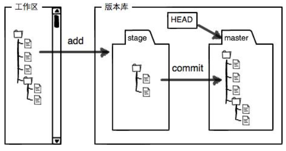
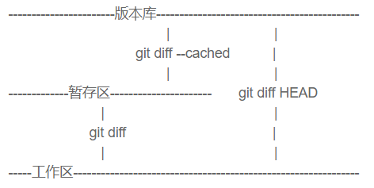

## git


`git init`：新建仓库

### 提交

### `touch readme.txt`

`git add readme.txt`

`git commit -m "create readme.txt"`

提交到了**本地仓库**


### 回退版本

`git log`查看以往版本

```
root@ubuntu-xenial:~/git# git log --pretty=oneline
1fb44d9fa1b238436e211c1a86bcd511812585a9 3->5
c0d39336272979011457f47cb3bbdf416677ebc0 1->3
b9ac34fddc12df3bf96e4252e8d6674df0ac5b86 create
```

`git reset --hard HEAD^`：回退到上一版本，**HEAD**表示当前版本，`HEAD^^`表示前两个版本

也可指定回退版本：`git reset --hard 1fb44d`

**Git在内部有个指向当前版本的`HEAD`指针，当你回退版本的时候，Git仅仅是改变了HEAD的指向**

**前提是还没有把自己的本地版本库推送到远程。**


### 查看每个版本的commit id

```
root@ubuntu-xenial:~/git# git reflog
1fb44d9 HEAD@{0}: reset: moving to 1fb44
c0d3933 HEAD@{1}: reset: moving to HEAD^
1fb44d9 HEAD@{2}: commit: 3->5
c0d3933 HEAD@{3}: commit: 1->3
b9ac34f HEAD@{4}: commit (initial): create
```




第一次修改 -> `git add` -> 第二次修改 -> `git commit`

提交到仓库的内容是第一次修改后的内容，而不是第二次。


### git diff 

`git diff`：工作区跟仓库分支的比较

`git diff --cached`：stage区和仓库分支上的比较，add后但是没有commit	，这个时候只是在stage中，可以确认下修改是否正确，如果正确无误可以commit合并到分支




### 丢弃工作区的修改

修改了readme.txt，通过`git checkout -- readme.txt` 让readme.txt这个文件回到**最近一次**`git commit`或`git add`时的状态。

- 一种是`readme.txt`自修改后还没有被放到暂存区，现在，撤销修改就回到和版本库一模一样的状态；

- 一种是`readme.txt`已经添加到暂存区后，又作了修改，现在，撤销修改就回到添加到暂存区后的状态。

**`git checkout -- file`命令中的`--`很重要，没有`--`，就变成了“切换到另一个分支”的命令。**


### 丢弃暂存区（stage）的修改

已经执行`git add`了，执行`git reset HEAD <file>`，可以把暂存区的修改撤销掉


### 删除文件

- 如果你用的rm删除文件，那就相当于只删除了工作区的文件，如果想要恢复，直接用`git checkout -- <file>`就可以
- 如果你用的是git rm删除文件，那就相当于不仅删除了文件，而且还添加到了暂存区，需要先`git reset HEAD <file>`，然后再`git checkout -- <file>`
- 如果你想彻底把版本库的删除掉，先`git rm`，再`git commit `就ok了

## 远程仓库

### 建立关联

`git remote add origin git@server-name:path/repo-name.git`

关联后，使用命令`git push -u origin master`第一次推送master分支的所有内容；

-u 会把本地的`master`分支和远程的`master`分支关联起来，在以后的推送或者拉取时就可以简化命令

以后只需要`git push origin master`就可以推送最新修改。


