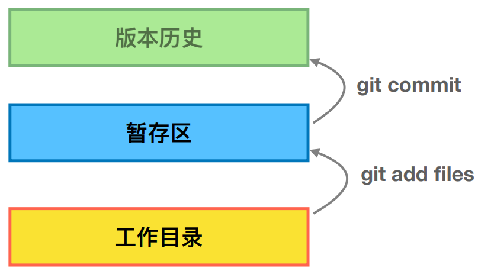
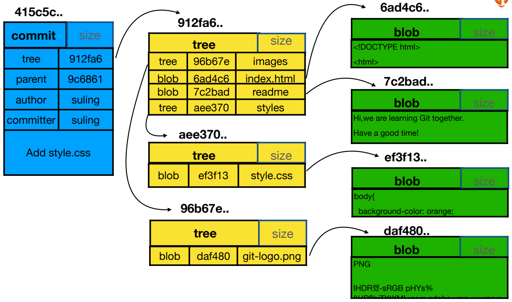
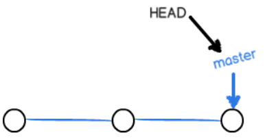
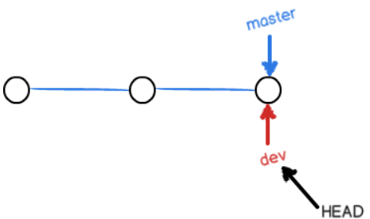
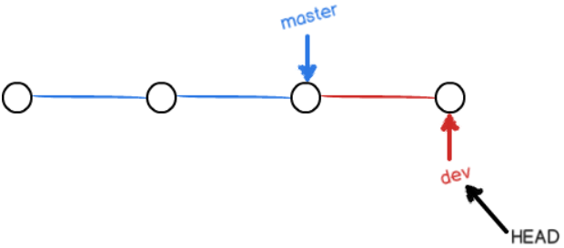
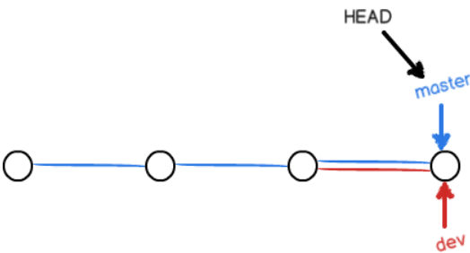
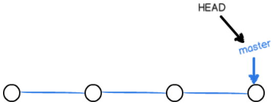
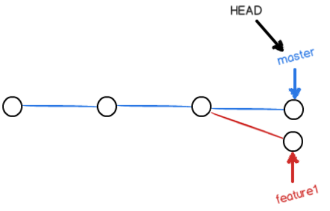
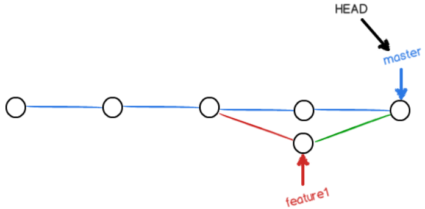

# git

## 基础使用

### git  config

```
# 针对该电脑上的所有用户进行配置
$ git config --system user.name 'xxx'
$ git config --system user.email 'xxx@xx.com'

# 全局配置用户信息
$ git config --global user.name 'xxx'
$ git config --global user.email 'xxx@xx.com'

# 配置在某个仓库中生效的用户信息(在该仓库中时，local的配置优先级比global高)
$ git config --local user.name 'xxx'
$ git config --local user.email 'xxx@xx.com'

# 查看配置信息
$ git config --global --list
$ git config --local --list

# 清除配置信息
$ git config --unset --global user.name
```


### 新建仓库

`git init`


### 提交

提交到**本地仓库**

```
$ touch readme.txt
$ git add readme.txt
$ git commit -m "create readme.txt"
```



对于tracked的文件，修改后，可以用`git add -u`添加至暂存区（u表示update）。


### 文件重命名

`git mv oldname newname`


### 查看版本演变历史

```
$ git log

# 在一行上展示一次commit
$ git log --oneline

# 查看最近的4个commit
$ git log -n4

# 图形化方式 查看 所有 分支
$ git log --all --graph

# 查看temp分支的coomit（如果有--all还是会查看所有分支）
$ git log --oneline temp

# 查看所有参数
$ git help --web log
```


### .git目录

```
$ cd .git && ls
config  description  HEAD  hooks/  index  info/  logs/  objects/  packed-refs  refs/

# 当前分支，切换分支时该文件会改变
$ cat HEAD
ref: refs/heads/master

$ cat config
[core]
        repositoryformatversion = 0
        filemode = false
        bare = false
        logallrefupdates = true
        symlinks = false
        ignorecase = true
[remote "origin"]
        url = git@github.com:wsfy15/useGit.git
        fetch = +refs/heads/*:refs/remotes/origin/*
[branch "master"]
        remote = origin
        merge = refs/heads/master
# 如果执行了git config --local user.name 'xxx'，则会有user的相关信息 

$ ls refs
heads/  remotes/  tags/

# 本地所有分支
$ ls refs/heads/
master

# 远程分支
$ ls refs\remotes\
origin/

# 存储一个指针
$ cat refs/heads/master
1e71a1f8f713efccd62244fe68a8c8694b4da892

$ git branch -av
* master                1e71a1f modified readme.txt
  remotes/origin/HEAD   -> origin/master
  remotes/origin/master 1e71a1f modified readme.txt
  
# cat-file -p 可查看内容  -t 查看类型(commit、tree、blob)
$ git cat-file -t 1e71a1f8f7
commit
```


#### commit、tree、blob三种对象间的关系



- 一个commit只能对应一棵tree，这颗tree记录了这次commit时的所有文件、目录。
- 目录也是一颗tree（图中images、styles为文件夹）。
- blob跟文件名没有关系，如果两个文件内容一样，git将其视为唯一的一个blob。节约存储空间。


### 回退版本

`git log`查看以往版本

```
root@ubuntu-xenial:~/git# git log --oneline
1fb44d9fa1b238436e211c1a86bcd511812585a9 3->5
c0d39336272979011457f47cb3bbdf416677ebc0 1->3
b9ac34fddc12df3bf96e4252e8d6674df0ac5b86 create
```

`git reset --hard HEAD^`：回退到上一版本，**HEAD**表示当前版本，`HEAD^^`表示前两个版本

也可指定回退版本：`git reset --hard 1fb44d`

**Git在内部有个指向当前版本的`HEAD`指针，当你回退版本的时候，Git仅仅是改变了HEAD的指向**

**前提是还没有把自己的本地版本库推送到远程。**


### 查看每个版本的commit id

```
root@ubuntu-xenial:~/git# git reflog
1fb44d9 HEAD@{0}: reset: moving to 1fb44
c0d3933 HEAD@{1}: reset: moving to HEAD^
1fb44d9 HEAD@{2}: commit: 3->5
c0d3933 HEAD@{3}: commit: 1->3
b9ac34f HEAD@{4}: commit (initial): create
```


第一次修改 -> `git add` -> 第二次修改 -> `git commit`

提交到仓库的内容是第一次修改后的内容，而不是第二次。


### git diff 

`git diff`：工作区跟仓库分支的比较

`git diff --cached`：stage区和仓库分支上的比较，add后但是没有commit	，这个时候只是在stage中，可以确认下修改是否正确，如果正确无误可以commit合并到分支


### 丢弃工作区的修改

修改了readme.txt，通过`git checkout -- readme.txt` 让readme.txt这个文件回到**最近一次**`git commit`或`git add`时的状态。

- 一种是`readme.txt`自修改后还没有被放到暂存区，现在，撤销修改就回到和版本库一模一样的状态；

- 一种是`readme.txt`已经添加到暂存区后，又作了修改，现在，撤销修改就回到添加到暂存区后的状态。

**`git checkout -- file`命令中的`--`很重要，没有`--`，就变成了“切换到另一个分支”的命令。**


### 丢弃暂存区（stage）的修改

已经执行`git add`了，执行`git reset HEAD <file>`，可以把暂存区的修改撤销掉


### 删除文件

- 如果你用的rm删除文件，那就相当于只删除了工作区的文件，如果想要恢复，直接用`git checkout -- <file>`就可以
- 如果你用的是git rm删除文件，那就相当于不仅删除了文件，而且还添加到了暂存区，需要先`git reset HEAD <file>`，然后再`git checkout -- <file>`
- 如果你想彻底把版本库的删除掉，先`git rm`，再`git commit `就ok了

## 远程仓库

### 建立关联

`git remote add origin git@server-name:path/repo-name.git`

关联后，使用命令`git push -u origin master`第一次推送master分支的所有内容；

-u 会把本地的`master`分支和远程的`master`分支关联起来，在以后的推送或者拉取时就可以简化命令

以后只需要`git push origin master`就可以推送最新修改。

### 

## 分支



默认情况下，HEAD指向master，master指向提交。每次提交，`master`分支都会向前移动一步，这样，随着你不断提交，`master`分支的线也越来越长。

### 创建新分支时做了什么

`git checkout -b dev`：`-b`参数表示创建并切换。相当于以下两条命令

```
$ git branch dev   # 创建分支
$ git checkout dev  # 切换分支

# 从某一个版本创建分支
$ git checkout -b new_branch_name version
```



新建dev分支时，新建了一个指针叫`dev`，指向`master`相同的提交，再把`HEAD`指向`dev`，就表示当前分支在`dev`上。

```
λ git branch
* dev
  master
```

*号表示当前分支。


从现在开始，**对工作区的修改和提交就是针对`dev`分支了**，比如新提交一次后，`dev`指针往前移动一步，而`master`指针不变。



完成修改后，执行`git add 和 git commit`。

### 合并分支



假如我们在`dev`上的工作完成了，就可以把`dev`合并到`master`上。Git怎么合并呢？最简单的方法，就是直接把`master`指向`dev`的当前提交，就完成了合并。

先从dev分支切换到master分支：`git checkout master`，此时查看被修改的文件，其内容和修改前一样。

再通过`git merge dev`合并修改。


合并完分支后，甚至可以删除`dev`分支。删除`dev`分支就是把`dev`指针给删掉，删掉后，我们就剩下了一条`master`分支。



```
λ git branch -d dev
λ git branch
* master
```


### 解决冲突

当不同分支同时修改同一个文件时，例如master分支和feature1分支都修改readme.txt，在两个分支都执行`add 和 commit`后，在master分支执行`git merge feature1`，会出现冲突。



```
λ cat readme.txt
welcome
<<<<<<< HEAD
I am master
=======
I am another
>>>>>>> another
```

此时只能修改出现冲突的文件，然后再执行`add 和 commit`。




可以使用`git log --graph --pretty=oneline --abbrev-commit`查看分支合并情况。

```
λ  git log --graph --pretty=oneline --abbrev-commit
*   2c939ba (HEAD -> master) fix conflict
|\
| * 8fd1223 (another) another modified readme.txt
* | 030e33f master modified readme.txt
|/
* 2acc150 '.'
* 277fc0e (origin/master) add branch
* 569fa04 add notebook
* 466ae31 create readme.txt
```


### 分支管理策略

通常，合并分支时，如果可能，Git会用`Fast forward`模式，但这种模式下，删除分支后，会丢掉分支信息。
如果要强制禁用`Fast forward`模式，**Git就会在merge时生成一个新的commit**，这样，从分支历史上就可以看出分支信息。

合并的时候执行`git merge --no-ff -m "merge with no-ff" brandch-name`。由于产生新的commit，需要带上-m。


### git  stash

利用该命令可以保存当前现场，然后切换到其他分支干活。完成之后再回到原始分支，并执行一下命令恢复现场

- `git stash pop`：恢复的同时把stash内容也删了
- `git stash apply; git stash drop`：若不执行后者，stash内容并不删除

可以多次stash，然后通过`git stash list`查看stash内容，并执行`git stash apply stash-name`恢复到某一状态。


### 多人协作

`git clone`后，执行`git checkout -b dev origin/dev`创建远程`origin`的`dev`分支到本地，之后`add commit push`。

### 如果在别人push之后执行push，需要先执行`git pull`获取最新的内容，pull前需要设置

`git branch --set-upstream-to=origin/dev dev`，指定本地`dev`分支与远程`origin/dev`分支的链接。之后再merge，如果有冲突，则解决冲突后push。

### rebase

- rebase操作可以把本地未push的分叉提交历史整理成直线；
- rebase的目的是使得我们在查看历史提交的变化时更容易，因为分叉的提交需要三方对比。

## 标签

标签与commit ID 的关系 类似于 域名和IP地址 的关系

### 创建标签

`git tag <name>`：创建标签
`git tag`：查看所有标签，不是按时间列出
`git show <tagname>`：查看标签信息
`git tag -a v0.1 -m "message" commitID`：创建带有说明的标签，用`-a`指定标签名，`-m`指定说明文字

默认标签是打在最新提交的commit上的，执行`git tag v0.9 commitID`对历史commit打标签。

### 管理标签

`git tag -d v0.1`：删除标签
创建的标签都只存储在本地，不会自动推送到远程。所以，打错的标签可以在本地安全删除。

`git push origin <tagname>`：推送某个标签到远程

`git push origin --tags`：一次性推送全部尚未推送到远程的本地标签

#### 删除已经推送到远程的标签

先本地删除：`git tag -d v0.9`
再远程删除：`git push origin :refs/tags/v0.9`


## 自定义git

### .gitignore

https://github.com/github/gitignore

添加被.gitignore忽略的文件：`git add -f App.class`

`git check-ignore -v App.class`：找出来到底哪个规则匹配忽略

每个仓库的git配置文件在`.git/config文件`中。

当前用户的Git配置文件放在用户主目录下的一个隐藏文件`.gitconfig`中。


## 从master分支clone，切换到其他分支进行开发

git clone后，执行`git checkout -b develop origin/develop`切换到develop分支。

`git checkout -b <lbranch> --track <remote>/<rbranch>`：从远程分支<rbranch>取得本地分支<lbranch>

提交的时候用 `git push origin develop`

`git push [remoteName] [localBranchName]`


